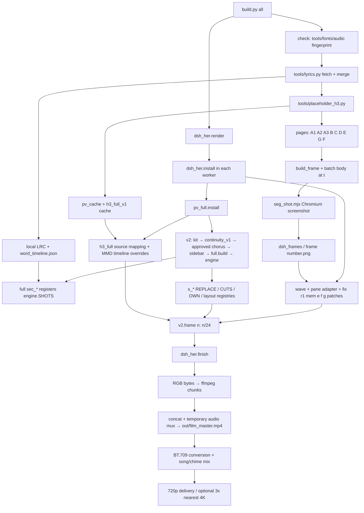

# 工程基线与逐帧调用链

审计日期：2026-10-01（Asia/Shanghai）。基线 `cb63fb6ba5832da38d79f95b8469464c1e2ddbf4`，origin 为 ShakeCrane/world-execute-me-adofai-pv；开始时工作树干净。未发现仓库内 AGENTS.md；遵循用户提供的禁止消耗任何 reset/paid/additional usage credit 指令。

本文件是源代码审计结果，不等于原成片逐帧验收。审计开始时本机 input 只有 README；没有歌曲、重建歌词、浏览器帧和 H3 缓存。后续已按原pipeline在忽略目录恢复本地歌词与timing，见04；歌曲仍未提供。PATH 未找到 ffmpeg/ffprobe，系统 Python 是 WindowsApps 启动别名；可用 Codex bundled Python 进行独立分析/PoC。原片全链构建尚未验证。

## 入口、依赖与调用图

注意 `build.py all` 的 render 在 pages 之后执行；图中 render 分支用于表示调用而非并行。`kit.py` 用 importlib 加载 v1；v1 加载 approved chorus，后者通过 sidebar 引入 full 引擎。大量导入在 import 时注册/改写函数，不应随意多次 install 或在共享解释器中比较不同版本。

### 左侧 HTML pipeline

`build_frame.py` 拼原 dsh CSS/classes/SVG。各 batch 计算确定性的 HTML body 和 sheet 集合，生成 `*_frames.json`；这不是运行聊天应用，也不调用模型。`seg_shot.mjs` 用 354×537、deviceScaleFactor=1 的 Chromium；等待字体/图片，暂停 CSS animation，将 currentTime 定位为 song time。统一截图文件名为五位整数帧；特殊 measure 帧写 `cursor.json`。浏览器版本、字体和 decode 状态也是可重现性依赖。

| 脚本 | 审计时的职责/依赖 | 区间（秒，近似） |
|---|---|---|
| batch_a1 | seed→首页→第一次输入；写 seg.html、初始头像 | 5.24–16 |
| batch_a2 | 同一输入下 checkpoint 回答递进、头像从噪声显现 | 16–29.28 |
| batch_a3 | 身份选择题，四种形状，对应右侧数学/模型镜头 | 29.28–44 |
| batch_b | SFT 红笔改写→RLHF 反馈/采样→NaN | 44.03–73.54 |
| batch_c | 部署、道具/角色扮演、生成后续会回看的记忆 | 73.54–103 |
| seg_page（D） | completion→离线→CSS/代码逐层拆除→单 cursor→伪造输入 | 103–125 |
| batch_e | Cordis 自安装/自批准、修改在线状态、retry 溢出 | 125–147.5 |
| batch_g | 新 session、回忆重答、logout、系统归档、黑场未发送问题；生成 chime | 177–211.9 |
| batch_f | execution 状态与 restore 失败；读取 E 结尾与 G 开头，故晚于 G 生成 | 147.5–177 |

分组时间和镜头时间并不完全相同；不能把 HOW_IT_WORKS 的整数秒直接当实际 cut。pages 顺序中 G 早于 F 是数据依赖。不要按字母重排。

### TUI 与 section system

`full/build.py` import 七个 sec_*，调用 build()/add(start,end,fn)，填缺口并 finalize；`engine.Ctx` 含 t、lt、dur、随机种子、chapter、alert、ops 等。`full/direction.py` 决定布局，stage/sidebar 提供 body。v1 提供 ALL/INDEX/BYNAME、已批准 chorus 和跨镜头调度。

`continuity_full_v2/v2.py` 默认 section 顺序：boot, pretrain, sft, chorus1, deploy, userleft, reward, exec, eval。可用 V2_SECTIONS 筛选，但仍沿用原 ALL；不是任意新片的通用时间线加载器。

| 注册项 | 实际含义与约束 |
|---|---|
| STUB | 安装 me_pane stub；body 调用时只记录主体需求，主体随后单独绘制 |
| REPLACE | 按原函数名替换 ALL 中 scene fn；仍用原时间/shot index |
| SPLIT | 强制主体 pane 与世界 pane 分栏 |
| FULL_ART | body 全宽；主体在开始前 0.3s 滑出、结束后 0.35s 回来 |
| SHELL | header/ticker retract，保留歌词；附 shell 字符串 |
| CUTS | incoming shot 在 ALL 的 index→Cut subclass；不是帧号 |
| HIDE_HER | 默认不画主体；Cut 可显式带回主体 |
| OVERLAY | shot name 或 index→全帧 RGBA overlay；在主体之上、chrome 之下 |
| OWN | index→finished RGB；cut 优先于 OWN；OWN 早返回，自管界面/后期 |

`cuts.body` 设 HOOK/STUB_ON，处理 DELAY，调用 sidebar.body；FULL 裁回 viewport。`Cut` 窗口允许 outgoing scene 在自己的 end 之后继续运行。`cuts.Frame` 携 content/ctx/over/her_shift/her_alpha/under；跨 cut 对象应作为独立透明载体，避免移动整个已含 UI 的 screenshot。

实际 `v2._frame` 优先级：active cut → OWN → scene body。black 或 finished image 可提前返回。一般合成顺序：body → under carrier（可选）→ her layer → OVERLAY → over carrier → kit.chrome（header/ticker/lyric）→ engine.post。dsh_her.finish 是最后一层，可能由 FINISH patch 全帧接管。

### dsh 替换与补丁

`dsh_her.install()` 先 pv_full.install，再 patch wave/header、vignette、可选 GPU、tuikit.box、kit.her_layer、scan_mix、props/anchor、approved me_pane 与 per-shot globals、chorus 的 figure。COVER 决定 screenshot 生效区间；LEAD 对另一侧降亮度（右侧支持亮度 0.42，左侧支持亮度 0.7）；RECT_FROM_CALL 可让窗口追随 scene rect。

`fix → r1 → mem → e → f → g` 是默认实际存在的安装次序；PATCHES 包含 d，但仓库无 dsh_patch_d.py，会跳过。`fix` 清舞者时代残留并让模型可视化从当前头像取样；`r1` 保持 feature ghost、采样居中、全窗 FP8、最后词至少完整停 6 帧/最多延后换行 2 帧、统一 you PID；`mem` 在 118.1–121.8 用 cursor、记忆 bubble 和 tile handoff；`e` 扩 COVER/LEAD、跟随 pane；`f` 接管 execution 和 collapse 等；`g` logout、系统归档、whale fall、black composer。部分 wrapper 有幂等标记；不能据此推断整个 install 可无条件重复。

## 时钟、确定性与输出

- 原音频元数据 duration=211.913s；顶层 END=211.9。`round(211.9×24)=5086`，range `[0,5086)`，最后 n=5085/t=211.875，容器视频长 211.9166667s。后续规范使用这个整数终点；211.9 只是名义时间。
- v1 COUNT=5064/DURATION=211，engine.END_T=211；pv_full 全片入口也用 5064。顶层 dsh render 才是当前最终入口。不要混用历史预览长度。
- v2 HARD_CUT=4970/24=207.083333s；G 同步采用这一帧。build 的 chime delay=207873ms，batch G beat clock 约为207.874s。DR 片不自动继承这个通知音的叙事含义。
- frame(n) 内 t=n/24；rng 通常由 n/shot 决定，H3 用 ContextVar 固定 song time，HTML animation 被固定。v2 常规后期调用 post(prev=None)，无跨帧 trail 状态；dsh worker 的预跑 frame(a) 是预热。仍有全局 patch/cache/外部素材/字体依赖，因此“纯函数”是目标约束，不是无环境条件保证。
- kit.fix_clock 重执行 choreo 源码，修 drum offset 和 feature RATE：22050/459≈48.0392Hz。不要把 full/music 默认 RATE=48 与修正后的 130BPM 时钟混为一谈。原 FIRST_BEAT 的不同常量也须按最终链选择，不能自行平均。
- full/music：缓存 loud/bands/kick/flux/cent，缺缓存时 ffmpeg 解码并计算；motion 是姿态参数、rig 是部位/字符网格；choreo 将节拍/歌词 anchor 转成动作。生产 H3 安装后取连续帧，不把旧 rig/静态图当 runtime fallback。
- pv_full 重排 direct/reuse/keep takes；h3_full 统一字符、点云、卷积等 source routes。placeholder_h3 静态读取计划，将鲸鱼娘立绘按节拍 warp，保持 take 名/索引格式，只跳过已完整缓存。替身不是原舞蹈，也不适合直接改名 Kris。
- dsh master chunks：libx264rgb qp=0、rgb24，无损视觉；concat 后原函数临时 mux AAC。顶层另取自备 song + chime 混音，BT.709 limited/yuv420p、x264 crf16 为 delivery；4K 是720p的3倍 nearest/x265，不是新细节。

## 原视觉元素 inventory（阶段一决定）

这些是结构决策，具体 canon/镜头需后续证据约束。

| 元素 | 决定 | 理由/DR 候选 |
|---|---|---|
| 左 DSH 窗口 | REPLACE | 控制 pane 保留位置，品牌/聊天身份改为 choice/SAVE/input grammar |
| her pane | ADAPT | Kris 是持续主体；保留跨场景位置与退出/返回编排 |
| avatar/鲸鱼娘 | REPLACE | 原角色不能被直接当作 Kris；程序化概念轮廓后补原创新美术 |
| 右 TUI | ADAPT | 内部世界→角色世界；保留网格/场景载体，替换模型科普内容 |
| header | ADAPT | 章节/连接/时间，避免扮成官方游戏 HUD 或虚构剧情计数 |
| ticker | ADAPT | 输入/选择/route 事件；不得无意义持续刷命令 |
| lyric band | KEEP | 保留逐词 timing，本地歌词恢复；不提交完整歌词 |
| waveform | KEEP | 同一首歌的可信音频节奏参考 |
| terminal/code | ADAPT | PV 作者的控制关系隐喻，明确不是游戏实际代码 |
| memory | ADAPT | SAVE/已选状态；不能声称所有角色跨存档记忆 |
| model visualization | REPLACE | world/route/character relationship，不能暗示 Kris 是 AI |
| dancer/H3 | REMOVE | 默认移出 DR 生产链；保留原代码，不删除缓存接口 |
| props | REPLACE | 只用有证据/主题作用的 cage/menu/string/door，不逐词硬贴蔬菜 |
| overlay | KEEP | SOUL/choice/crossing connection 等独立透明层 |
| transitions/carriers | KEEP | 控制对象跨 pane，主题行为即转场 |
| cuts | ADAPT | 复用机制，不沿用每个旧 cut 的剧情对象 |
| full-screen art | ADAPT | 角色世界占满画布；不自动等于角色已自由 |
| collapse/disappearance | ADAPT | SOUL 分离/输入通道中断；不是死亡或完全脱离 Story 的证据 |
| cursor | ADAPT | menu SOUL 与分离 SOUL 共用红色几何；不宣称 SOUL=Player 已确证 |
| glow/trail/scanline | ADAPT | 克制；可读性优先，trail 由时间采样形成而非全局上一帧 |
| ending | REPLACE | 重建谁执行谁的问题，移除鲸落/聊天退役结论 |
| red pen/feedback | REMOVE | 不继承 AI 对齐叙事；choice 拒绝/重试另设计 |
| split pane/lead dimming | KEEP | 阅读重心可从输入移向 Kris/Story |
| noise/glitch | ADAPT | 必须由输入冲突/route lock/边界破坏触发，非恐怖滤镜 |

## 架构取舍与后续验证

优先新增独立 DR timeline/data + small renderer，复用 tuikit 的字体、scanline/post、透明层思路；先不 import v2 以免强制需要歌词/H3/旧剧情。Shot Bible 后决定是否给 v2 添真正新 ALL adapter。仅添 s_dr 模块而不换 ALL 会沿用错误时间和 index，是已排除的快捷方案。

验证点：每个 section start、关键 handoff、transition 中帧、情绪峰、偏离前后、终段。对整数 n 保存 still/hash；同一 n 顺序/乱序/重复 render 应相同。CPU/GPU 后期不是已证实像素等价。原链只在 input/tools 到位后跑少量指定帧，再考虑全片。

许可：不删 LICENSE/NOTICE/第三方 attribution；新 DR 控制图形与作者 UI 可程序化绘制，但版权政策和游戏角色权利需另立 provenance，不把 MIT/CC 条款延伸给 Mili 或 DELTARUNE。

辅助静态清单：`data/deltarune/baseline_inventory.json`，由 `tools/audit_deltarune_baseline.py` 生成；记录原文件 hash、函数位置、imports、section keys，不导入生产模块，不复制歌词。静态 imports 不代表解析完成的 runtime dependency graph，调用图依据以上人工追踪。
