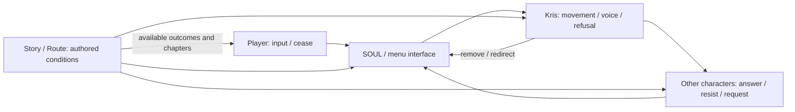

> 历史设计/研究记录（v0.1或暂停v0.2）：保留材料，不是当前上位分镜。当前歌词导演依据见09_LYRIC_DIRECTOR_LEDGER、10_DIRECTOR_REWRITE、06 v0.3与STATUS。旧镜数/排期/PoC范围不代表当前状态。

# 主题模型：执行权不是所有权

Kris 占据原 PV 持续主体的位置；不是 AI、容器人格或人类玩家的空白皮肤。开头把输入和身体看作一体，中段让动作/声音/视角出现不同归属，结尾暴露 Player 选择的“偏离”仍经过 Route 的接口。要深化谁执行谁，不给单一凶手判决。

## 四个变量与它们的局限

P（PLAYER AGENCY）=能选择什么及能否改变结果；K（KRIS AGENCY）=可见独立动作/表达；O（OTHER CHARACTER AGENCY）=他人拒绝、接受、误认或主动索求；S（STORY/ROUTE CONTROL）=当前实现的条件、菜单、章/预言边界。0–3仅是导演的画面强调级，不是游戏数据或自由意志测量。必须附事实和限制；“输入数量多”不等于 P 高。

| 主题节点 / 证据 | P | K | O | S | 本片如何推进 |
|---|---:|---:|---:|---:|---|
| vessel offer→discard E01 | 2→0 | 未现→1 | 0 | 3 | 先给予制作权限，再收回主体选择 |
| normal party E02/03 | 2 | 1 | 3→2 | 2 | 世界对输入有答复与抵抗，关系不只是伤害 |
| SOUL cage E04/05 | 1（心可移动） | 3（身体行动） | 0 | 3（scene强制） | 失去身体控制仍非退出观看 |
| NEO strings E06/07 | 2 | 1–2 | 2 | 2 | 切线会坠落；角色的感受不可被按钮概括 |
| Ch3 nested game E13–19 | 2 | 2 | 2 | 3 | 想出界需满足更深层规则，Kris保护他人 |
| Ch4 ordinary organ/prophecy E21/22 | 2 | 2 | 2 | 3 | agency可共存；prophecy角色言说留下不确定 |
| Ch2 weird delegation E08–12 | 3（作用强）/1（条件窄） | 1 | 1 | 3 | 强力输入透过 Kris 压迫 Noelle；power与自由分开 |
| Ch4 re-entry E23–28 | 3→1 | 3→1→3 | 1–2 | 3 | 窥视/重入/锁定/反冲；Kris仍是动作与代价中心 |
| Ch5 bed/lake E31–34 | 1（结果窄） | 1–2 | 3（主动要求） | 3 | 被塑造的对象开始索求旧命令，Player成为重复操作员 |
| Ch5 halt/continuation E36 | 2（停止可改变进程） | 2 | 2 | 3 | 回到另一段仍留后果，不等于清白还原 |
| chapter boundary E35 | 1（可结束/离开） | 未知 | 未知 | 3 | 可选择继续/中止，但无权提供未来章节 |

Normal 不是假自由/无关暖场。每次共同动作先建立“输入可能帮助角色”，后面才可看懂“同一选择 grammar 如何被扭曲”。Susie 从不服从到愿意合作，不画成永远不受玩家影响；Noelle主动态度和风险必须同时呈现。Kris不依赖输入的行为既包括保护/友谊，也包括创建Fountain，保留动机未明。

## 关系图

S→P是作品的解释，不把“Story”说成 canon 人物；Noelle→I来自 E32/33 索求/否定 Stop。P可停止输入是模型必需出口。闭合箭头只代表关系反馈，不声称游戏真的调用现实计算机。

## 情绪与叙述顺序

0–29s：连接、身份收回、共同世界，冷中有暖。29–58.6：点/圆/波/无限转为角色定位和有限菜单；先揭露规则。58.6–73.5：合作的满足→切线落空，亲密不必是拥有。73.5–103：角色的日常能力与舞台角色、Kris拒绝、prophecy，继续增加复杂性。103–125：共同动作完整→分离→私话→输入越过门。125–147.5：Weird条件与ring既往痕迹显影，避免顺序拼章。147.5–177：命令重复、选择缩减、屏幕越界、输入被要求继续。177–193.5：Noelle的主动索求与停止可能并置，不把情歌写成强迫的赞歌。193.5–207.083：越界被章节接口包围。207.083–211.9167：留在开放问题；退出也是一种输入边界，未来没有被作者填上。

叙事采用主题交叉而非时间顺序。不同章节在不同音乐段回访；一镜标明来源章节，连续剪接不伪装为游戏同一时间发生。

## Motif 的三次变义

- 红心：可选→可囚→仍要按键的接口。它的存在不证明外部 Player 灵魂身份。
- 白框：选择邀请→门/身体通道→route和chapter边界。框不是纯粹敌人，开始帮助读懂世界。
- 手：帮助/送行→代行命令→反冲/迟疑。角色不是菜单上的肖像。
- 连线：行动关联→强迫传播→上游也连着规则。切断后保留主体，并不让它消失等同死亡。
- 空位：vessel被收回→Berdly未归/选择空白→未来章节空缺。三个空位意义不同，避免统一“抹除”特效。

## 结尾的具体判断

开放结尾不是“人人都没有自由”。它问：改变方向的愿望，是谁发出的，谁实现的，谁预设了可接受的结果？屏幕最终保留Kris的轮廓/手和一个输入心；route框仍存在。最后作者文字只出现一次“Who executes whom?”，不由任何游戏角色说出；不回答未发布结局。

