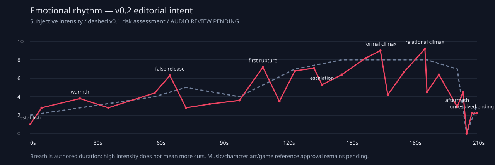

> 历史设计/研究记录（v0.1或暂停v0.2）：保留材料，不是当前上位分镜。当前歌词导演依据见09_LYRIC_DIRECTOR_LEDGER、10_DIRECTOR_REWRITE、06 v0.3与STATUS。旧镜数/排期/PoC范围不代表当前状态。

# Creative Director Review / v0.1 → v0.2

本轮完整阅读00–08、STATUS、67镜JSON/101655字符Bible、旧PoC manifest与源码。原HEAD仍cb63fb6ba5832da38d79f95b8469464c1e2ddbf4；第一轮文件在工作树尚未提交，先归档v01设计和PoC以免覆盖既有成果。没有重做剧情调研，没有新canon判断。

## 导演判断

v01是一份可解释的控制关系草图，尚不足以作为优秀PV的画面稿：构图计数 {'full': 10, 'split': 33, 'close': 13, 'nested': 8, 'black': 3}，多数维持同一左右读区。后半的变化集中在菜单文字/心位/框大小；结尾还要观众先理解三层矩形的概念。短‘离开’段2650–2784在5.583秒内分5镜，情感动作还未被看清就换构图。旧PoC人物持续近静止，Noelle引路仅是说明；小灰影不能建立Susie的关切。

本轮不把hash一致当艺术质量。逐镜N/V/E为导演主观1–5分：叙述必要性、与相邻约15秒相比的视觉新意、当前设计情绪强度。高N不必高预算；低V可用合并/换机位处理而不是加glitch。

## 四个关键区间

A 0–29.8s：八个主体/参数镜头压成两次决定，再用帮助→拒绝→主动合作的手部动作建立Normal。Kris在130帧开始显露；删除双名字表，把SAVE延后88秒，首次观看只需记住同一角色和红心。

B 99–125.6s：DR34–40归为两条相连长镜。先留完整身体→同一手抽出同一心→心仍可动而身体走开；笼/vent是主题match，非虚构章节连通。私域镜头降低信息，再以实体菜单门重入。删除前段balloon离体，保护第一次明确认知断裂。

C 147.9–177s：十二次命令在同一世界留下压力，前后半改摄影机/空间，不换12张海报。HERO跨TV后camera被它带走，Kris仍在侧缘；拉开Susie、攻击落在空位、Susie断线有明确先后。删掉69秒提前演保护的preview，保留这次自主行为的冲击。

D 177–211.9s：Noelle伸手带着menu跨向世界，身体/selector节奏独立。停止表现为pulse不再到来，既往冷痕仍在；不加暂停按钮。继续后命令由角色手势催回。唯一的边界大揭示是湖成为实体CRT表面，摄影机拉后露机身/输入plug；不再画三层白矩形。纯黑24帧，章提示36帧，随后回迟疑手/心，再问一次作者问题。

## Motif 必须完成的弧

| motif | 建立/熟悉 | 变义 | 反转/回收 |
|---|---|---|---|
| SOUL | 自然选择点、帮助行走 | 手抽出后仍能动，身体另行 | 移到HERO；同文仍能移；最后仍在而调用方向未定 |
| Choice | 小邀请、不常驻 | 通道门、接触条件 | Noelle手携入世界；被实体屏幕接住，不是一路加框 |
| Hand | 接受/共同迈步/能力 | 推开、抽心、施加与反冲 | 拉开Susie、拔线、Noelle引路、最后迟疑 |
| SAVE / name | 延至身体熟悉以后只一次覆盖 | 名字可改而身体仍同一 | 不用第二张哲学name卡，不宣称跨存档记忆 |
| boundary | 门/TV提供可读空间 | 内载体走到边缘、外心走进私域 | 实体CRT和chapter断点成为上游边界，Story无脸 |
| connection | 只在确需读归属时短亮 | 命令跨过低身位，输入对象迁移 | 被动作断开；不靠无处不在红线解释合作 |
| empty slot | vessel被撤回的空位 | 四空项/冰空位的不同代价 | 未发布章节留白，不能统一成死亡抹除 |
| colour | 同一Kris的暖关系/靛蓝世界 | 既有绿色与暖光逐渐失重 | 冰/湖压力里仍有衣袖，结尾不只黑白哲学 |

## 情绪节奏

曲线是导演假设，不是已听音结论。v01虚线表示后半强度平台风险；v02用73秒坠落后的低点、85秒日常、118秒私域、170秒空白、189秒停输入和203秒手的停顿保住两次不同高潮：约166秒是形式/摄影机高潮，约187秒是关系高潮。最后不是第三次大高潮。

## 全部67镜复审与去向

| v01 / title | N/V/E | action → v02 | 理由 |
|---|---|---|---|
| DR01 / 连接先于身体 | 4/4/2 | 合并 → PV01 | 心先成为自然焦点；不单独切一次空场 |
| DR02 / 保护的双义 | 3/2/2 | 合并 → PV01 | 保护框只留开口四角，暂不解释囚笼 |
| DR03 / 可以制造的形状 | 3/3/2 | 合并 → PV01 | vessel用一个合拢动作，不列三种部件菜单 |
| DR04 / 接受主体 | 3/2/2 | 合并 → PV01 | 接受动作并入vessel；第四次概念cut不值得 |
| DR05 / 身份表格 | 1/1/1 | 删除 → — | VESSEL/CREATOR双栏使开场信息超载；姓名问题延后一次 |
| DR06 / 收回选择 | 5/3/3 | 提前/升级 → PV02 | Kris在130帧开始揭露，不能等观众记住表格才成为主体 |
| DR07 / 世界已有其人 | 5/2/3 | 合并 → PV02 | 房间显露与身份替换连成同一push-in |
| DR08 / 输入与行动 | 5/3/3 | 延长 → PV03 | 输入帮角色行动先成立；用跨地形的动作，不画延迟参数 |
| DR09 / 一起向前 | 4/2/3 | 合并 → PV03 | 合作前同地面行走，去掉ACT/SPARE常驻格 |
| DR10 / 不接受命令 | 5/3/4 | 保留/降级 → PV04 | Susie自发偏离队形只一回，角色动作比refusal字卡重要 |
| DR11 / 合作是关系变化 | 5/3/4 | 延长/升级 → PV05 | 主动回到Kris身旁成为温暖记忆点，留时间看手 |
| DR12 / 谁的存档名 | 3/2/2 | 延后/合并 → PV14 | 开头不再追加SAVE概念；88秒处只有一次姓名覆盖 |
| DR13 / 点与身体 | 3/3/2 | 合并 → PV06 | 点成身体留视觉趣味，不再把Kris当参数面板 |
| DR14 / 圆内可选 | 2/1/2 | 删除独立构图 → PV06 | 选项圆环提前讲两位置同结果，抢走后段反转；转为地面投影 |
| DR15 / 同一波不一样的手 | 4/3/3 | 延长 → PV07 | 手与键盘可建立角色能力；先不强调输入/意志分离 |
| DR16 / 无限仍在框内 | 2/1/2 | 删除 → — | 无限路径撞白框又是边界图解；后面已有物理门/屏幕 |
| DR17 / 切换控制通道 | 4/3/3 | 合并 → PV08 | 只建立一次controller/TV空间，之后出屏才能回收 |
| DR18 / 只能看此处 | 3/2/3 | 合并 → PV08 | 删除2度旋转与小地图说明，让背影和屏幕关系先成立 |
| DR19 / 时间也是接口 | 2/1/2 | 删除 → — | SAVE时间格重复名字/route，读者需文档才懂 |
| DR20 / 靠近不是合并 | 4/2/3 | 延长/降级 → PV09 | 三人同路用低UI宽景呼吸，不再画双向合作线 |
| DR21 / 可提供的可能性 | 4/2/4 | 合并 → PV10 | 可能性由悬吊线实际支撑表示，不给三条候选菜单 |
| DR22 / 最后一根 | 5/3/5 | 合并 → PV10 | 最后线有停顿再释放；成功操作的期待必须留住 |
| DR23 / 动作也可以保护 | 3/2/4 | 删除 → — | 提前演Kris拉Susie会削弱168秒最重要的自主行动 |
| DR24 / 落空的自由 | 5/4/5 | 延长/升级 → PV11 | 坠落后不要立刻转场；空的支撑线和Kris手留下失望 |
| DR25 / 供给的能力 | 4/3/3 | 延长/降级 → PV12 | 能力/照顾不能全是UI，器官键与肩动做角色表演 |
| DR26 / 给予不等于讨好 | 3/3/3 | 删除 → — | balloon提前展示SOUL离体，破坏110秒第一次认知断裂 |
| DR27 / 角色的回应 | 4/2/3 | 保留/降级 → PV13 | 他者回头和共同空间作为呼吸；不另画回应波 |
| DR28 / 存在不靠所有权 | 4/2/3 | 合并/降级 → PV14 | 单次SAVE名字覆盖；不做重叠name卡哲学图 |
| DR29 / 同一个人 | 3/2/3 | 合并 → PV15 | 用同一个身体的环境/衣色改变，不切属性卡 |
| DR30 / 日夜之外的动作 | 3/2/3 | 重写 → PV15 | 去掉提前藏SOUL；只拉帘/换光，先维护连接的习惯 |
| DR31 / 舞台角色套住输入 | 2/1/3 | 删除 → — | 第二次舞台套层重复44秒TV，且挤压Normal气质 |
| DR32 / 能力与输入共存 | 4/2/4 | 合并 → PV16 | 合奏准备分离，少一个organ示意，手共同完成动作 |
| DR33 / 共同振动 | 4/2/4 | 合并 → PV16 | 删除input/action两波的科普，把同步留给身体 |
| DR34 / 完整不是拥有 | 5/3/5 | 合并/升级 → PV17 | 分离前留完整身体，摄影机已经在同一房间 |
| DR35 / 离开身体 | 5/4/5 | 延长/升级 → PV17 | 真正抽心放大为连续动作；手/胸/心不能靠换图完成 |
| DR36 / 输入仍在 | 5/2/5 | 合并 → PV18 | 心移动而身体不跟，是分离后的hold，不应再cut |
| DR37 / 世界不跟输入退场 | 3/1/4 | 合并 → PV18 | UI退去跟随身体越过读区，不是每词拆一块CSS |
| DR38 / 保护变容器 | 4/2/4 | 合并 → PV18 | 开头保护角回成实体笼；同一心撞边后仍可动 |
| DR39 / 身体独自行动 | 5/3/4 | 合并 → PV18 | Kris自主步行要与心同时可见，不能切掉参照 |
| DR40 / 隔离是空间问题 | 4/2/4 | 合并/转场 → PV18 | 笼格→vent是明示主题match，不假装Ch1房间通向Ch4 |
| DR41 / 不是菜单制造的声音 | 5/3/3 | 降级/呼吸 → PV19 | 门内两人处于私域；回忆声不加VOICE/KRIS解释字 |
| DR42 / 菜单是一扇门 | 5/4/5 | 延长/升级 → PV20 | 物理菜单像门跨入房间；外心闯入才能产生空间不适 |
| DR43 / 偏离也有条件 | 4/2/4 | 降级 → PV21 | 回退条件用有尽头地面，不另做条件表 |
| DR44 / 路线锁定的代价 | 5/3/5 | 合并/升级 → PV22 | 抓腕→红裂→反冲连成一次接触代价，避免猎奇特写 |
| DR45 / 反冲到接口 | 5/3/5 | 合并 → PV22 | 只一次抽心/踢桶，回震到自身；不能成自由胜利 |
| DR46 / 命令没有随身体倒下 | 5/2/4 | 降级 → PV23 | 低身位与外部命令同时可见，给下一段压迫前的静默 |
| DR47 / 逃离需先拿到钥匙 | 4/3/4 | 延长 → PV24 | 小游戏阻力逐步拉紧，不重复闪方向箭头 |
| DR48 / 框外还有框 | 3/1/5 | 重写 → PV24 | 删更大白框；镜头逼近实体TV边，保留出屏空间 |
| DR49 / 命令一至六 | 5/2/5 | 合并/升级 → PV25 | 前六pulse造成世界里的压力，不是六次缩menu |
| DR50 / 命令七至十二 | 5/2/5 | 合并/升级 → PV25 | 后六加摄影机和空间挤压；12个唱词起音仍逐一保留 |
| DR51 / 谁发出最后呼唤 | 5/2/5 | 降级/转场 → PV26 | 不写KRIS/YOU；input落到HERO，视角随后被它带走 |
| DR52 / 走出屏幕 | 5/4/5 | 升级/重写 → PV27 | HERO跨屏而摄影机跟错对象；Kris保留侧缘而非被替换 |
| DR53 / Kris会保护别人 | 5/4/5 | 升级/延长动作 → PV28 | 拉开Susie先于攻击落空，再拔线；动作总长不压在24帧 |
| DR54 / 归来的空白 | 5/2/3 | 降级/呼吸 → PV29 | 四个空slot很短，主要是Kris/Susie之间未说出的停顿 |
| DR55 / 起床的阻力 | 5/2/4 | 换构图/降级 → PV30 | 起床从低机位看手撑地，身体慢与输入急不同节奏 |
| DR56 / 她开始索求命令 | 5/3/4 | 合并/升级 → PV31 | Noelle向input伸手、把menu带入世界，第一次主动反向跨层 |
| DR57 / 拒绝仍然向前 | 5/2/4 | 合并 → PV31 | Stop拒绝落在实际牵引上；不再保持旧PoC静态人物 |
| DR58 / 两个位置同一结果 | 5/2/5 | 升级/重写 → PV32 | 菜单贴两只手；同文时selector可移，Kris身体仍独立 |
| DR59 / 停止也是输入的边界 | 5/2/3 | 降级/呼吸 → PV33 | 停止是pulse消失，不另给暂停按钮；冷痕和关切留下 |
| DR60 / 继续的代价 | 5/2/4 | 重写/过渡 → PV34 | 继续后手势要求再组织控制；删两条按钮式分支图 |
| DR61 / 把湖留在画面里 | 5/2/4 | 合并/升级 → PV35 | 湖成为实体CRT的表面，用景深/机身揭示取代套框 |
| DR62 / 上游也有接口 | 4/1/4 | 删除旧方案 → PV35 | menu→route→chapter三矩形是概念图，不进入v02成片 |
| DR63 / 不急于给答案 | 5/2/2 | 保留/呼吸 → PV36 | 回到有衣袖的手，最后20秒仍有角色 |
| DR64 / 提交至章节边界 | 5/3/4 | 降级/过渡 → PV37 | 最后pulse只触一次接点，屏幕收成线，不再抬外框 |
| DR65 / 要求来自下一层 | 5/2/2 | 延长黑场 → PV38 | 纯黑改24帧，SideB短提示留36帧，不展下一章 |
| DR66 / 调用方向未定 | 5/2/2 | 合并/呼吸 → PV39 | 同一迟疑手与心重新出现，不再画两个方向箭头 |
| DR67 / 谁在执行谁 | 5/2/2 | 合并/保留 → PV39 | 作者问题在角色余韵之后出现，保持末帧，不成为角色台词 |

## 制作预算与仍待实证

v0.2共39镜，12 HERO：PV02/05/11/17/20/22/25/27/28/31/32/35。它们负责身份、暖关系、落空、分离、重入、接触代价、执行空间、出屏/保护、反向牵引/同文、实体边界。其余镜明确Support/Breath/Transition；不存在所有镜头都升级的预算假象。

P1 PV27–28、P2 PV17–20、P3 PV01–05/14、P4 PV31–39优先渲染并目视，按结果修订。在文字稿阶段仍待验证：camera跟错是否读得懂、Susie拉开是否早于攻击、单心连续性、Noelle手是否主动、CRT pullback是否空间揭示而非小电视贴图、末段能否留下角色情感。

AUDIO REVIEW PENDING；R01–03游戏精确画面、角色美术验收未完成。完整rough只需blocking和连续movement/transition意图；不能承诺最终音乐/艺术质量，更不能把本稿直接当final。失败的旧图解进入archive而不留在活动计划。

