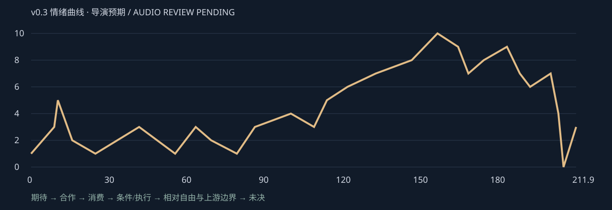

# DIRECTOR REWRITE v0.3

2026-10-04。v0.1的67镜及暂停v0.2都是历史；本轮38镜歌词驱动，不保护旧实现。09_DIRECTOR_REVIEW.md仍保留为上轮记录，新上位导演稿为本文件与09_LYRIC_DIRECTOR_LEDGER.md。

## 主要否定

1. 灰Vessel退/绿Kris在同锚点显出不足以防误读。改具体部件/参数→空台→另处既存Kris硬切。
2. 数学图标和常驻pane代替人；改脚步预测/手超模型，保完整身体。
3. 首Execution切最后线/坠落过早阴森；删除此处NEO，改帮助抬路板。
4. 碎片段私话/重入服务事件而非erase语法；改剪枝，重入移have-back。
5. 十二冰柱虽连续仍近击杀计数；改十二次不同关系状态。
6. Love不能只是湖菜单；先回收自愿伸手/给予，再显合规答案不能完成关系。
7. Free先承认Player能停；之后才见上游边界，不能一句话取消相对自由。

## 五幕与每10–20秒观看问题

| 秒区间 | 第一眼与情绪变化 |
|---|---|
| 0.000–16.000 | Creation：期待→权利断裂；主观紧张1/10 |
| 16.000–29.790 | Union：谨慎→温暖；主观紧张2/10 |
| 29.790–44.420 | Union：好奇/建模未尽；主观紧张3/10 |
| 44.420–59.040 | Union：真实合拍；主观紧张2/10 |
| 59.040–73.920 | Consumption：探索→独占→善意执行；主观紧张3/10 |
| 73.920–88.540 | Consumption：生活暖→权力依赖；主观紧张1/10 |
| 88.540–103.540 | Consumption：角色投入；主观紧张4/10 |
| 103.540–118.250 | Consumption：完整→持续缺席；主观紧张5/10 |
| 118.250–134.670 | Execution：剪枝→两层违规；主观紧张7/10 |
| 134.670–147.875 | Execution：条件压力；主观紧张8/10 |
| 147.875–162.583 | Execution：十二关系滑移；主观紧张10/10 |
| 162.583–177.458 | Execution：失控→保护→重入；主观紧张8/10 |
| 177.458–190.583 | Recursion：依恋→合规不等于爱；主观紧张9/10 |
| 190.583–202.625 | Recursion：相对自由→上游边界；主观紧张6/10 |
| 202.625–211.917 | Recursion：余波→未决；主观紧张3/10 |

曲线为导演预期，非已听音测量。每段第一眼Kris或开场Vessel；关系列在06及逐行09。完整silent rough只验空间/剪辑，音乐同步保持PENDING。

## Motif建立、三次变义、回收

| motif | 建立/熟悉 | 第二义 | 第三义/回收 |
|---|---|---|
| 输入/同一心 | 配置、善意行动/合作 | 传播、交接、与身体隔离 | 主动索求反转来源；输入能停但接口仍有章界 |
| 手 | 靠近、抬板、给予/抚摸 | 取心、收手、保护、拔线 | 求回应与迟疑；正确答案未完成握手 |
| 条件路径 | If/Then提供接触 | 更多可能变Only目标剪枝 | 特殊结果也走既有门槛，不物理删时间线 |
| 保护边 | 邀请/保护容器 | 笼隔开input与body | 机身/章界接住越界，但Player仍能离开 |
| Execution | LR14中性善意run | 条件强制与消灭阴影 | Only过程身份被手反证，最后caller不署名 |
| Love | 普通给予、等彼此 | 学习回应被优化成合规答案 | 能停也不消后果/依恋，LV只阴影 |

## 预算

{'SUPPORT': 18, 'HERO': 12, 'TRANSITION': 3, 'BREATH': 5}。12 HERO集中在关系变化与动作/空间。Breath有肩/水纹/低幅动作或有意hold；不是静态图片填时长。本轮不作任何艺术加工；原几何实验不作为本轮验收。

## 全67旧镜去向

新编号为LR；旧画面不复用。对应表按实际时间交叠，允许多对多重排，理由明确必要性/视觉新意/情绪的替换。

| 旧镜/秒 | 新载体 | 决定与N/V/E理由 |
|---|---|---|
| DR01 / 0.000–1.792 | LR01 | 重做/合并：供电具体化 |
| DR02 / 1.792–3.875 | LR01 | 重做/合并：保护先邀请 |
| DR03 / 3.875–5.417 | LR02 | 重做/合并：部件真实选配 |
| DR04 / 5.417–7.375 | LR02 | 重做/合并：Object组装期待 |
| DR05 / 7.375–10.125 | LR03 | 重做/合并：恢复Vessel参数 |
| DR06 / 10.125–11.208 | LR04 | 删除旧事件/替换：否定同锚点叠化 |
| DR07 / 11.208–12.750 | LR05 | 重做/合并：另处已有Kris |
| DR08 / 12.750–16.042 | LR05 | 重做/合并：输入帮助 |
| DR09 / 16.042–19.833 | LR06 | 重做/合并：同行身体动作 |
| DR10 / 19.833–23.625 | LR07 | 重做/合并：Susie拒绝 |
| DR11 / 23.625–27.292 | LR08 | 重做/合并：合作延长 |
| DR12 / 27.292–29.792 | LR08 | 删除旧事件/替换：删除早SAVE插断 |
| DR13 / 29.792–33.458 | LR09 | 重做/合并：测量不能代人 |
| DR14 / 33.458–37.083 | LR09 | 删除旧事件/替换：删圆菜单 |
| DR15 / 37.083–40.833 | LR10 | 重做/合并：波线贴地手另动 |
| DR16 / 40.833–44.417 | LR10 | 重做/合并：模型未完成 |
| DR17 / 44.417–47.708 | LR11 | 重做/合并：模式切换非控制切换 |
| DR18 / 47.708–51.458 | LR11 | 重做/合并：camera视野非TV教程 |
| DR19 / 51.458–55.083 | LR12 | 重做/合并：旅行弱影非时间canon |
| DR20 / 55.083–59.042 | LR12 | 重做/合并：真实同伴温度 |
| DR21 / 59.042–63.042 | LR13 | 删除旧事件/替换：删除过早NEO |
| DR22 / 63.042–66.292 | LR13 | 删除旧事件/替换：删除首次执行前切线 |
| DR23 / 66.292–70.125 | LR14 | 重做/合并：首次执行重做帮助 |
| DR24 / 70.125–73.917 | LR14 | 删除旧事件/替换：删除过早坠落 |
| DR25 / 73.917–77.708 | LR15 | 重做/合并：日常食物替organ |
| DR26 / 77.708–81.292 | LR15 | 重做/合并：普通给予非理论卡 |
| DR27 / 81.292–85.125 | LR16 | 重做/合并：猫与回应 |
| DR28 / 85.125–88.542 | LR17 | 重做/合并：权力依赖世界而非SAVE占有 |
| DR29 / 88.542–91.875 | LR18 | 重做/合并：同一身体呈现 |
| DR30 / 91.875–95.625 | LR18 | 重做/合并：日夜同手 |
| DR31 / 95.625–99.250 | LR18 | 重做/合并：关系role非性别改造 |
| DR32 / 99.250–103.542 | LR19 | 重做/合并：技能与input共存 |
| DR33 / 103.542–107.125 | LR19 | 重做/合并：真实合拍 |
| DR34 / 107.125–110.417 | LR19 | 重做/合并：completion不生存绑定 |
| DR35 / 110.417–112.208 | LR20 | 重做/合并：同心一次离体 |
| DR36 / 112.208–113.250 | LR20 | 重做/合并：合并持续absence |
| DR37 / 113.250–113.917 | LR20 | 重做/合并：合并身体不随心 |
| DR38 / 113.917–114.750 | LR20 | 重做/合并：保护边回收成笼 |
| DR39 / 114.750–116.000 | LR20 | 重做/合并：一次自主走开 |
| DR40 / 116.000–118.250 | LR20 | 重做/合并：同次缺席hold |
| DR41 / 118.250–122.000 | LR21 | 删除旧事件/替换：删除此处私话改剪枝 |
| DR42 / 122.000–125.583 | LR21 | 重做/合并：重入移have-back |
| DR43 / 125.583–128.875 | LR22 | 重做/合并：God双层冲突 |
| DR44 / 128.875–131.208 | LR22 | 重做/合并：锁定移十二节点 |
| DR45 / 131.208–134.667 | LR22 | 重做/合并：反冲移十二节点 |
| DR46 / 134.667–138.458 | LR23 | 重做/合并：越身体命令移节点 |
| DR47 / 138.458–142.167 | LR23 | 重做/合并：门槛作器乐压力 |
| DR48 / 142.167–147.875 | LR23 | 删除旧事件/替换：删除无限套框 |
| DR49 / 147.875–153.417 | LR24 | 重做/合并：前六变关系状态 |
| DR50 / 153.417–159.208 | LR24 | 重做/合并：后六变对象/边界/主动 |
| DR51 / 159.208–162.583 | LR25 | 重做/合并：计数为作者接口回声 |
| DR52 / 162.583–166.167 | LR26 | 重做/合并：保留出屏空间 |
| DR53 / 166.167–169.667 | LR27 | 重做/合并：保留保护拔线 |
| DR54 / 169.667–173.500 | LR28 | 重做/合并：归来重做物理重入 |
| DR55 / 173.500–177.458 | LR29 | 重做/合并：We双侧迟缓成本 |
| DR56 / 177.458–181.000 | LR30 | 重做/合并：主动索求留Love感情 |
| DR57 / 181.000–184.583 | LR30 | 重做/合并：Stop留差异非全无效 |
| DR58 / 184.583–188.292 | LR31 | 重做/合并：同文与未完成手并置 |
| DR59 / 188.292–190.583 | LR32 | 重做/合并：先承认Player能停 |
| DR60 / 190.583–193.917 | LR33 | 重做/合并：爱与接口纠缠 |
| DR61 / 193.917–198.333 | LR34 | 重做/合并：唯一上游CRT揭示 |
| DR62 / 198.333–202.625 | LR34 | 重做/合并：实体机身非大框 |
| DR63 / 202.625–205.375 | LR35 | 重做/合并：身体余波 |
| DR64 / 205.375–207.083 | LR36 | 重做/合并：最后caller不署名 |
| DR65 / 207.083–208.500 | LR37 | 重做/合并：章界不画未来 |
| DR66 / 208.500–210.458 | LR37/LR38 | 拆分/重排：开放手与心 |
| DR67 / 210.458–211.917 | LR38 | 重做/合并：作者问题不善恶判决 |

## 下一独立艺术gate

全部38镜都要用户造型/材质复审。高风险：LR02/04 Vessel≠Kris；LR08暖回应；LR09/10投影不是本体；LR14木板重量；LR15/16食物/猫生活性；LR17依赖视角；LR18 S/M强度；LR20同一心取出；LR21剪枝非毁世界；LR22 God两层；LR24十二状态可读；LR26/27保护空间；LR28重入触感；LR30/31 Love与LV显著度；LR32停止余痕；LR34 CRT材质；LR38未完成手。先复审表演/空间，再选风格，不进行最终美术扩张。

## 15项自检落点

本轮只进行剧情/分镜逻辑复核，以下是设计落点，不声称实际画面艺术验收；11为先前几何实验的历史记录。
1. LR02–04部件/参数/丢弃空位，配置权非主体权。
2. LR05另处既存Kris，不morph。
3. LR06–08/12可信合作。
4. LR09/10身体完整且手超预测。
5. LR14首执行帮助无杀戮。
6. LR13回访→21剪枝→23门槛→24升级。
7. LR15/16普通食物与猫。
8. LR17世界不灭、控制需回应。
9. LR20一次absence持续。
10. LR21灰路保留，目标导向剪枝。
11. LR22局部收手与上游退回并置。
12. LR24十二状态，只有一冰封不判死亡。
13. LR30/31 Love先感情，LV短阴影。
14. LR32先能停，34才上游。
15. LR38手/心开放问题不判三方善恶。
